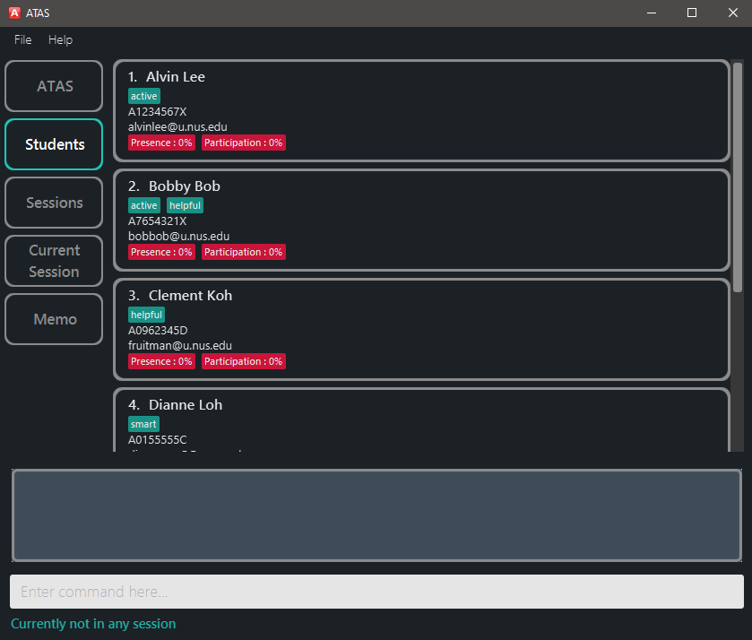

**Addendum for Teaching Assistants (ATAS)** is a desktop applicaton that aims to make users' teaching experience effortless. It has a GUI but most of the user interactions happen using a CLI (Command Line Interface).

In the current version, ATAS targets NUS Teaching Assistants (TA) that are teaching the CS1010S module.

With ATAS, users can mark attendance, track students' progress, send emails to students and many more.

* If you are interested in using ATAS, head over to the [_Quick Start_ section of the **User Guide**](UserGuide.html#quick-start).
* If you are interested in developing ATAS, the [**Developer Guide**](DeveloperGuide.html) is a good place to start.

## Site Map
* [User Guide](/docs/UserGuide.md)
* [Developer Guide](/docs/DeveloperGuide.md)
* [About Us](/docs/AboutUs.md)

## Acknowledgments
* This project is based on the AddressBook-Level3 project created by the [SE-EDU initiative](https://se-education.org).
* Libraries used: [JavaFX](https://openjfx.io/), [Jackson](https://github.com/FasterXML/jackson), [JUnit5](https://github.com/junit-team/junit5)
